# Klasse 1 

## Stimme und Synthese

( C. Roads / Microsound )

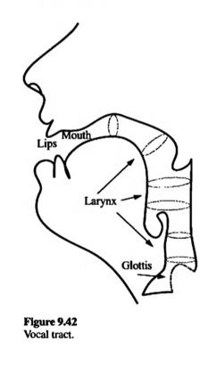

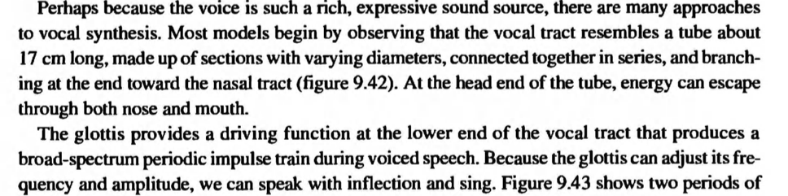

### Impulse und Stimme

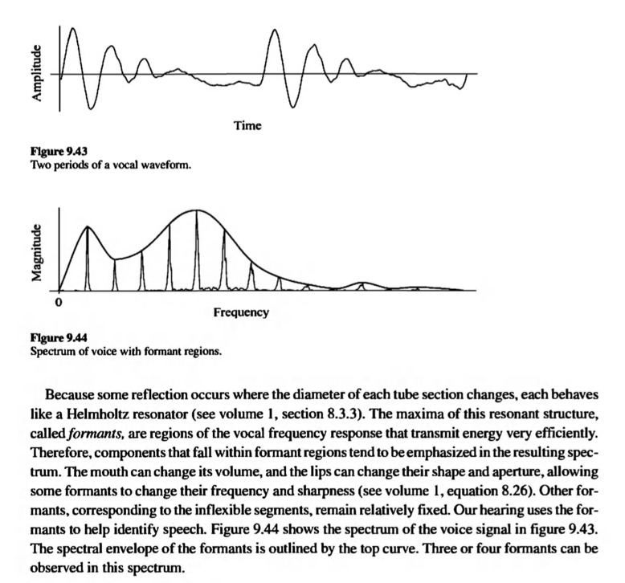

### Formant

- A Formant is a peak of energy in a spectrum, which can include both harmonic and inharmonic partials as well as noise. 
Formant peaks are a characteristic of the spoken vowel sounds and the tone color of many musical instruments

( C. Roads )

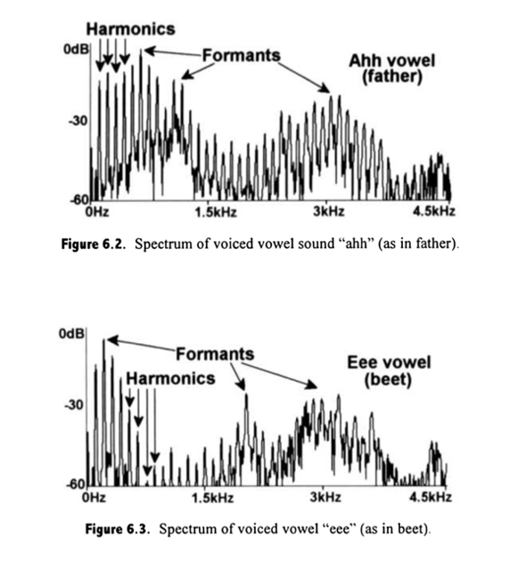

### Experiment mit AudioXPlorer

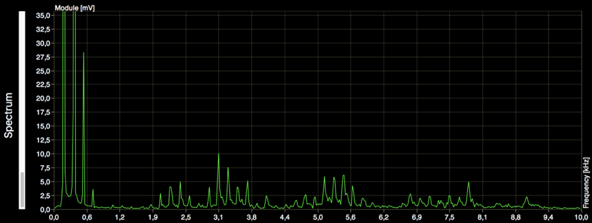

[Download for MacOSX](http://www.arizona-software.ch/audioxplorer/)

### Formantsynthese

- FOF
- Vosim
- Window Function

### Frage der Stimmsynthese 

Wie kann man einen Formant ohne Aufnahme / Sampling erzeugen?

- AM ?
- Band pass filter?

#### AM

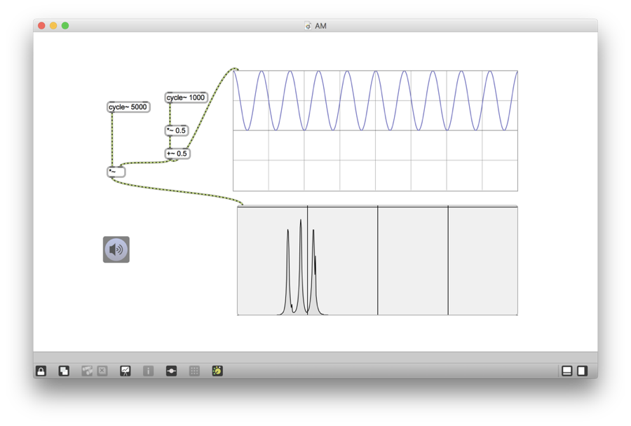

#### AM und Fensterfunktion

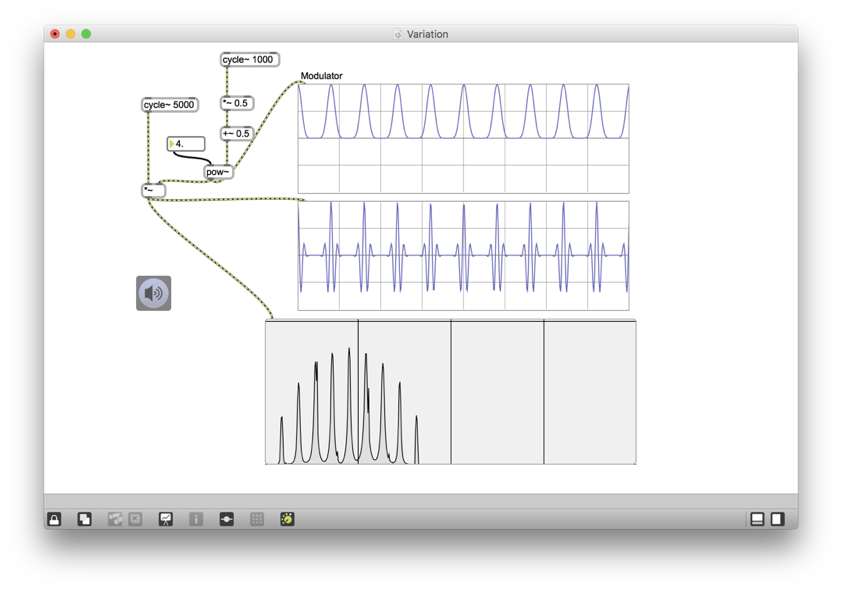

- Die Ähnlichkeitzwischen Granularsynthese und AM
	- Carrier = Klangquelle	
	- Modulator = Fensterfunktion

### Exponent

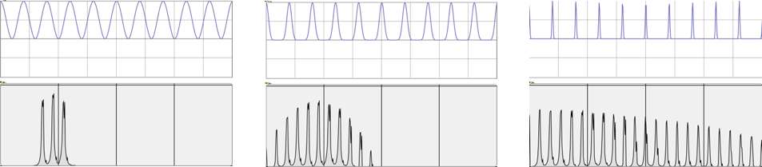
Exponent : 1 (AM) / 5 (Formant) / 100 (Impulse)

### die Idee von FOF

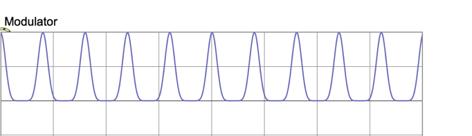

Modulator-Pulse sind jetzt symmetrisch, Wie klingt AM, wenn diese Pulse unsymmetrisch ist?

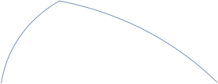

## FOF (fonction d’onde formantique)

FOF generates a stream of grains, each separated by a quantum of time, corresponding to a period of fundamental frequency.

### Eigenschaften

- Wellenform = Sinus
- Hüllkurve : glatte oder Schnelle Attack und exponentielle Decay

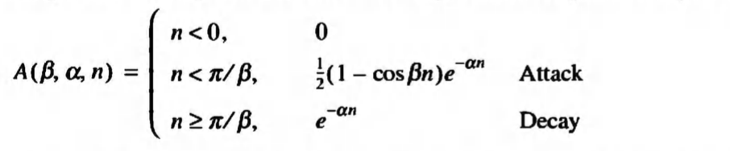
n …  sample in time
β … attack sharpness
α … decay control

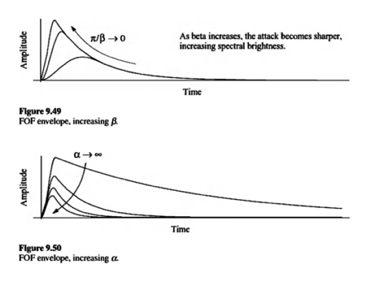

### Umsetzung in Max1  (Hüllkurve)

##### Kern (gen~)
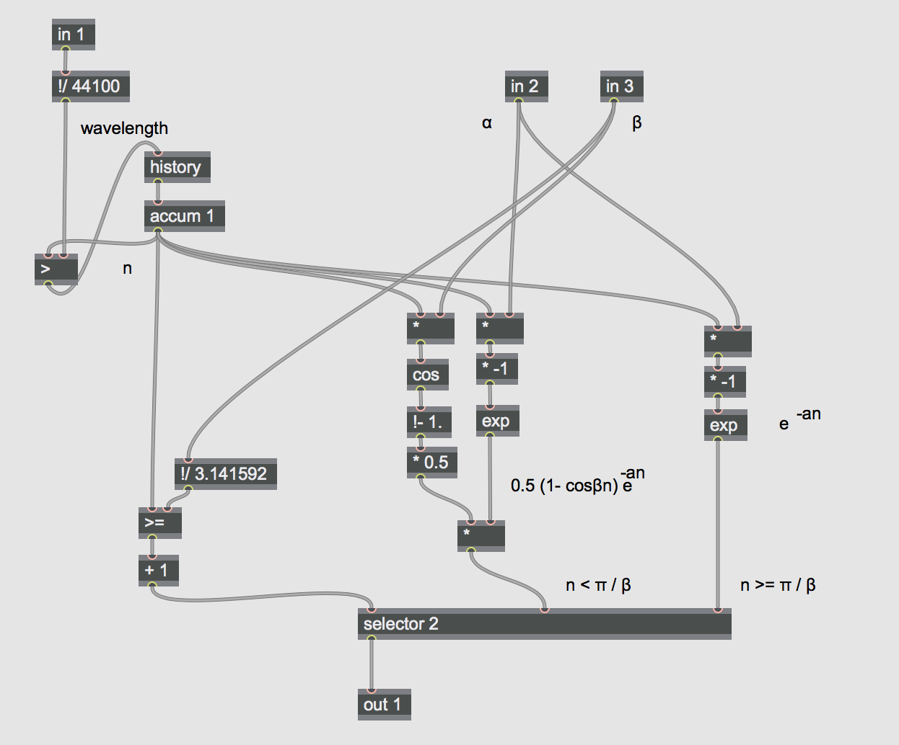

#### Kontroll
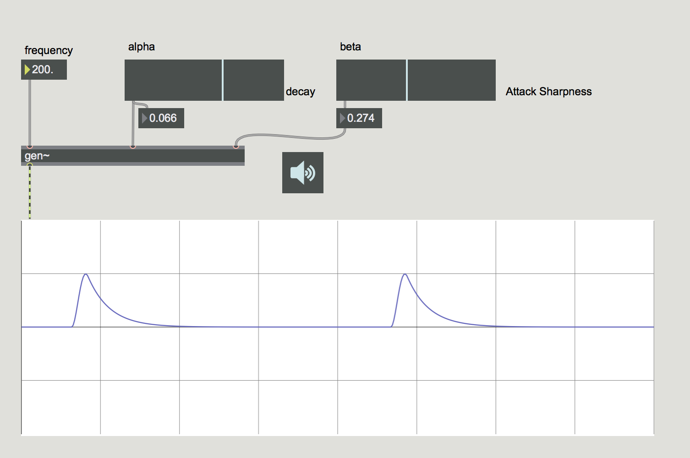

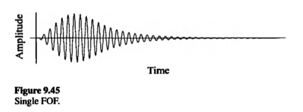

### Experiment mit Max2 (Mit Sinus)

##### Kern (gen~)
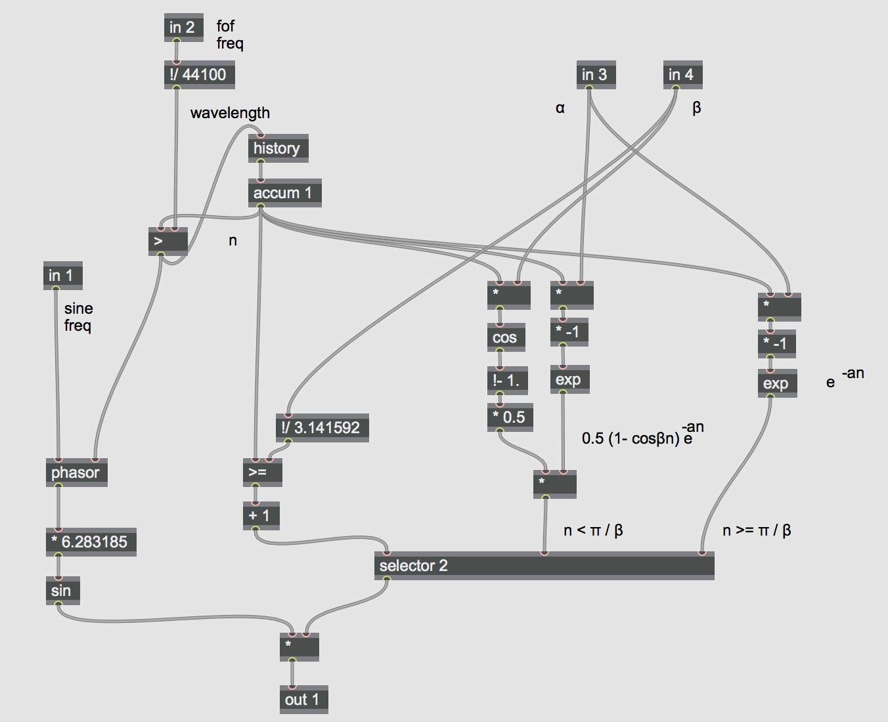

#### Kontroll
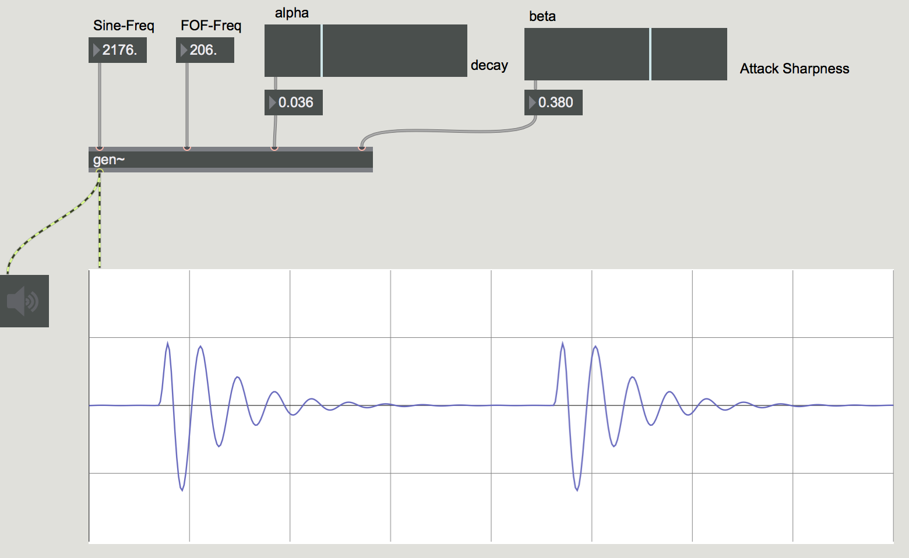

### Mehrere FOFs

to simulate the principal vocal formants of the voice, between three and five trains of FOFs are generated and summed.

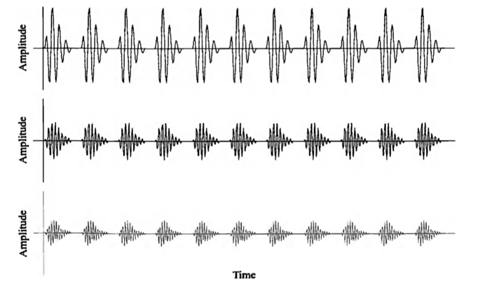

### Experiment mit Max 4 (Multiple FOFs)

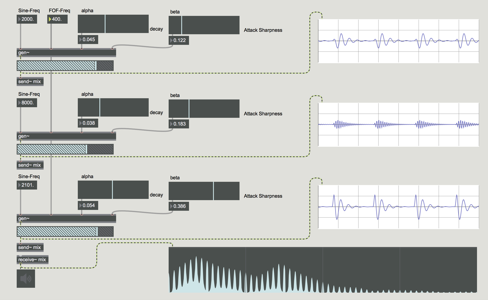

