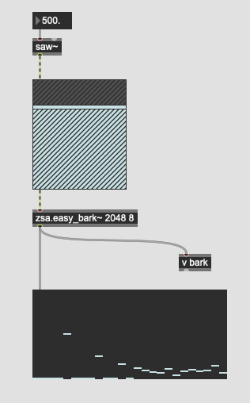
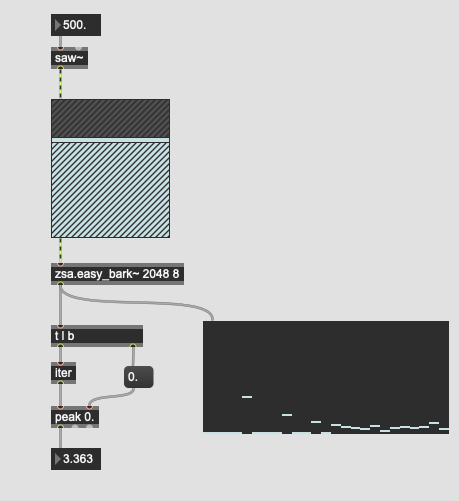

# Klasse 10 - Klangfarbeerkennung

## zsa.bark~ Normalisierung

### Problem

### Peak Detector

### Normalisierung

### Abtastung mit Normalisierung

### Vergleich mit Noramlisierung

## zsa.dist

## zsa.skewness~

