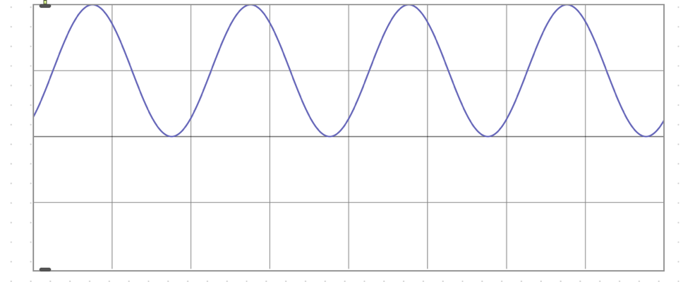
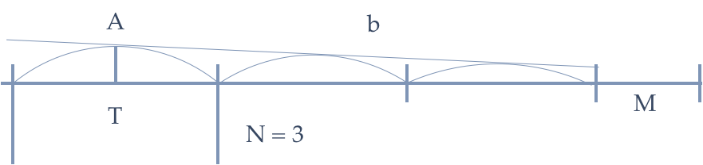
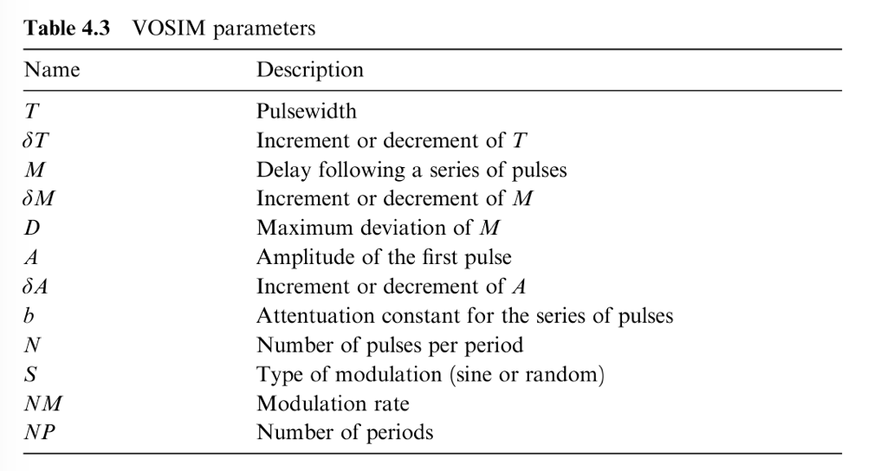
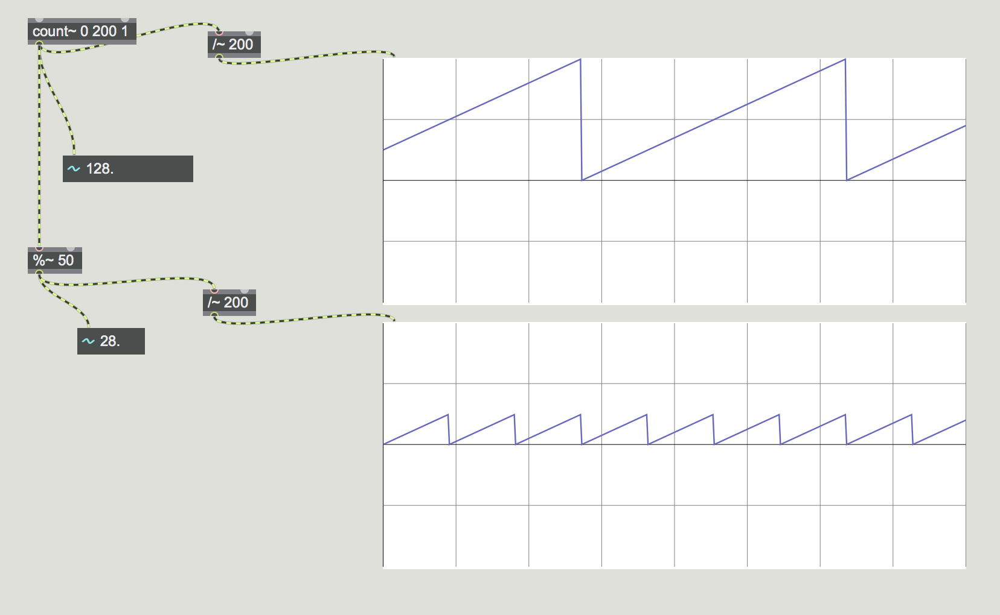
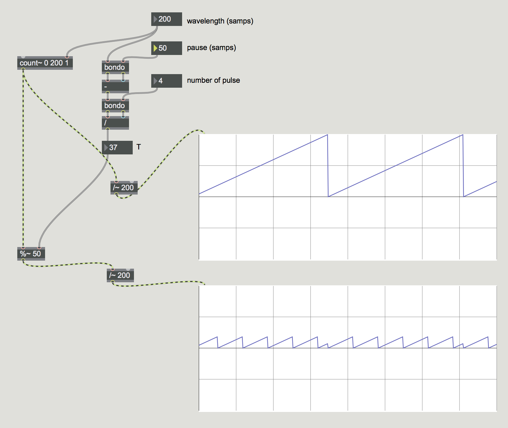
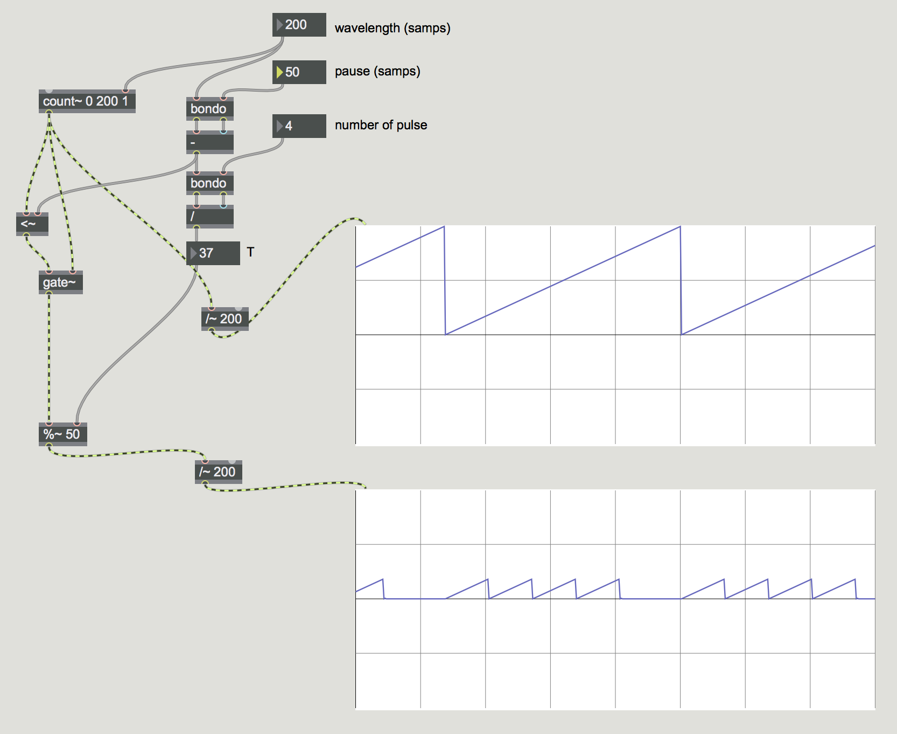
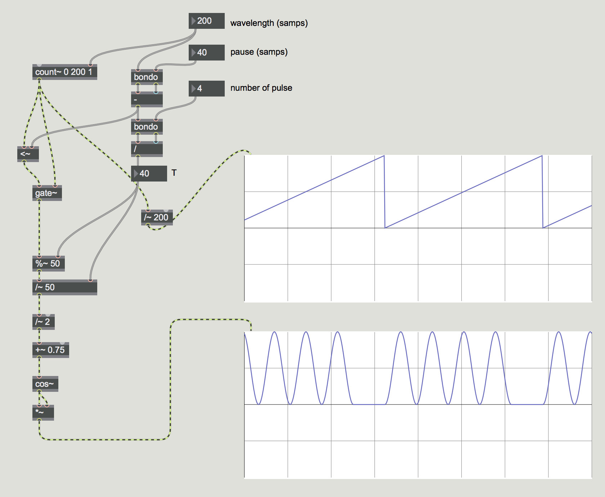

# Klasse 2 

## VOSIM

VOSIM = Voice Simulator

The VOSIM waveform approximates the signal generated by the human voice in the form of a series of pulse trains, where each pulse is the **square of a sine function.** 

### Parameter

The parameter **A** sets the amplitude of the highest pulse.
Each of the pulse trains contains **N** squred sin pulses in series
The pulses decreases in amplitude by a decay factor **b**.

The width (duration) of each pulse T determines the position of the formant spectrum
A variable-length delay M follows each pulse train
The period is N x T + M

### Umsetzung in Max

- Große Wiederhodung (period) + Kleine Wiederholung (pulse train)
- Pause (M)
- Hüllkurve (schrittweise)

#### Kleine Wiederholungen in einer großen Wiederholung

- count~ - zählt nummer
- %~ - modulo

#### Pause am Ende einer Periode

#### Pulse statt Sägezahn

#### Decay

## Wavefunktion

