# Klasse 3

## Impuls und Antialiasing

### Pulse und Aliasing

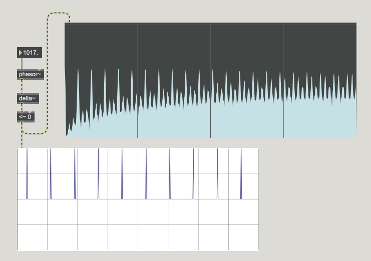

### Lowpass?

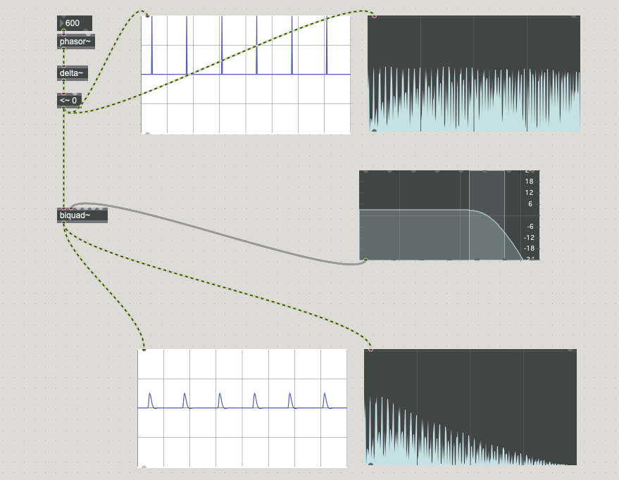

- Ändert Amplitude von Grundton
- Das Problem von Antialias minimeren aber nicht komplett vermeiden

### Band limited pulse

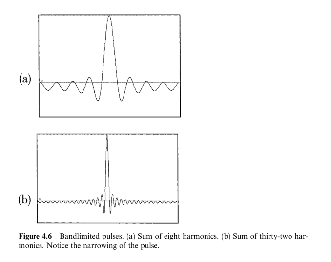

### Sinc Funktion

Sinc ... cardinal sine function

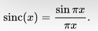
where x ≠ 0

#### Visualisierung mit GeoGebra

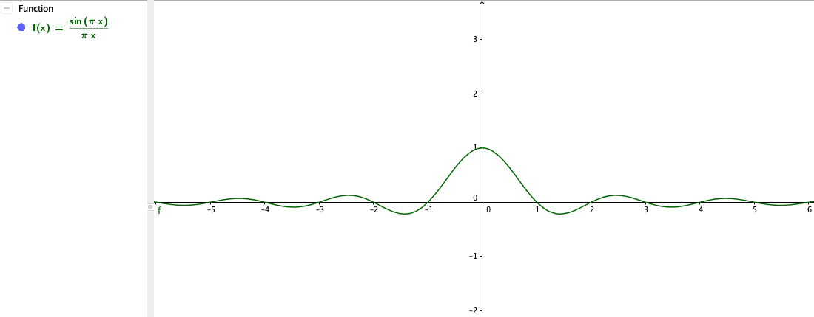

#### Umsezung von Sinc in Max
##### Schritt 1
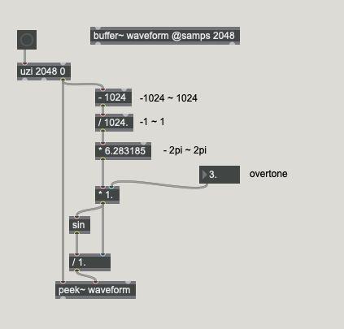

##### Schritt 2
where x ≠ 0

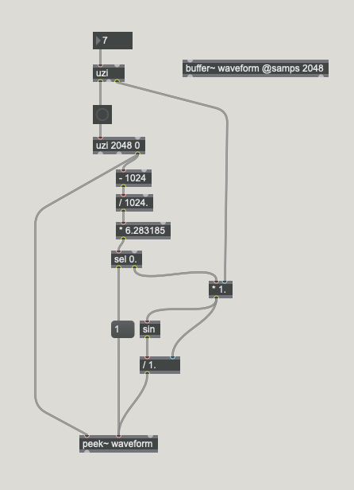

##### Schritt 3
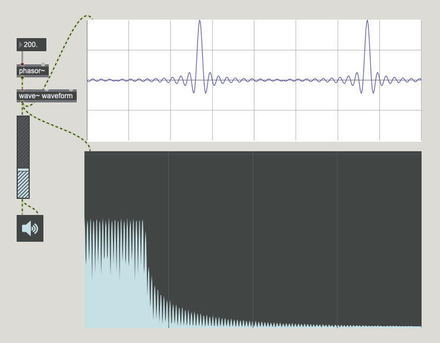

### rect~ / saw~ sind antialiased

#### rect~
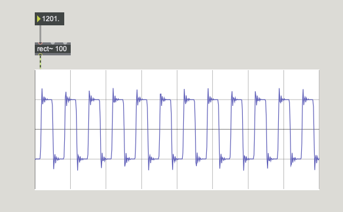
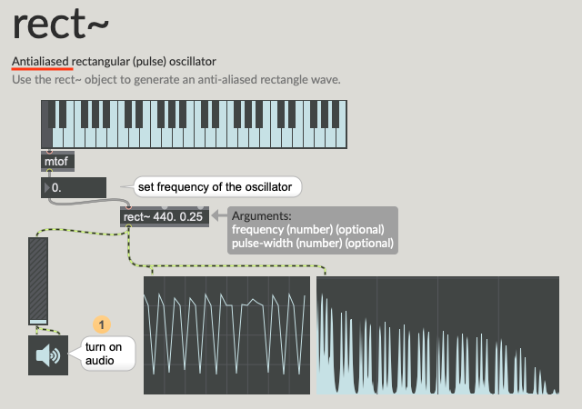

#### saw~
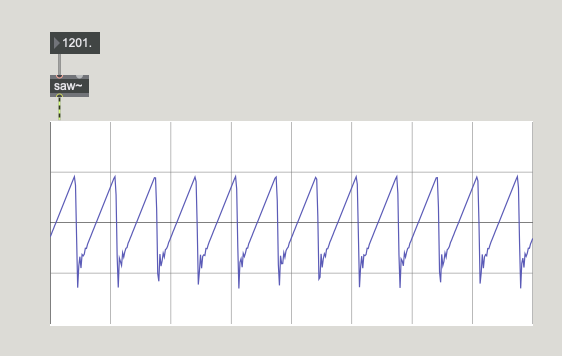
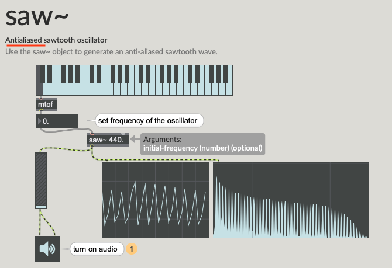

## Pulser Synthese

### Pulse Train

rect~ generiert Pulse Train

### Duty Cicle

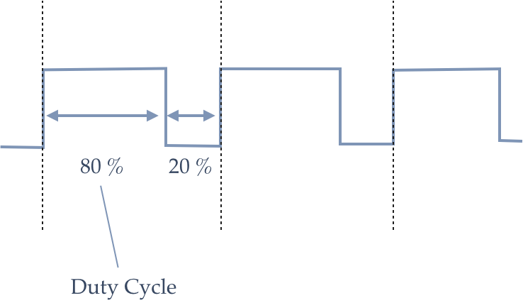

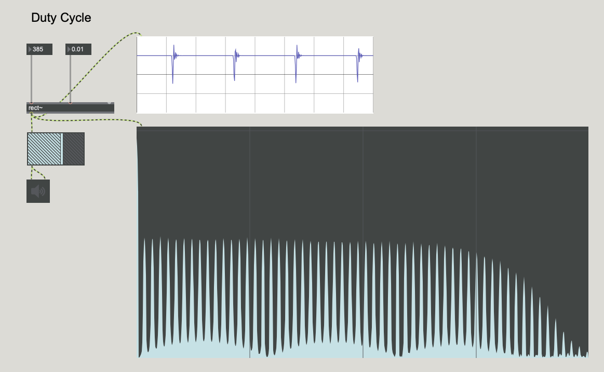

je kurzer DC desto mehr Obertöne

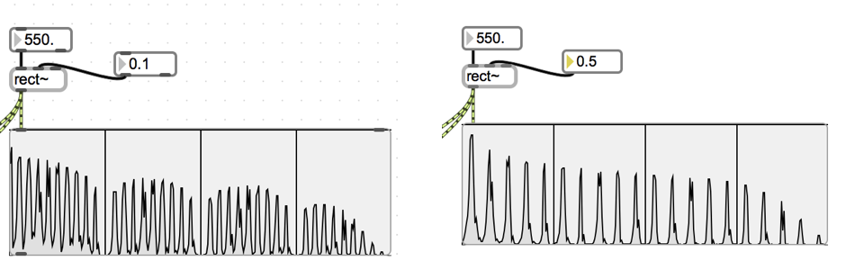

### Pulser Synthese

man kann nicht nur Pulse sondern auch andere Wellenform für die Duty Cicle benutzen.
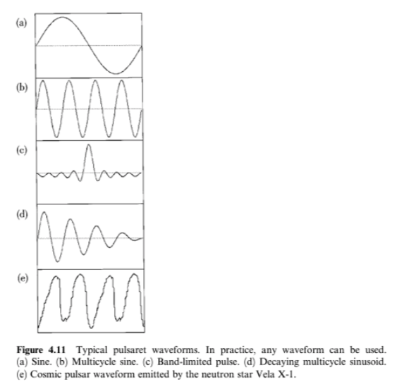

Für die Duty Cicle kann man auch unterschiedliche Hüllkurve verwenden
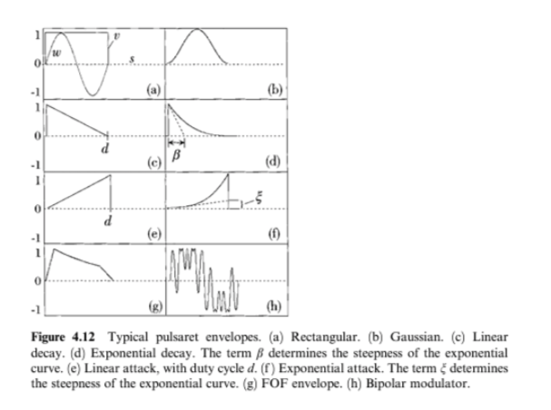

### Umsetzung in Max

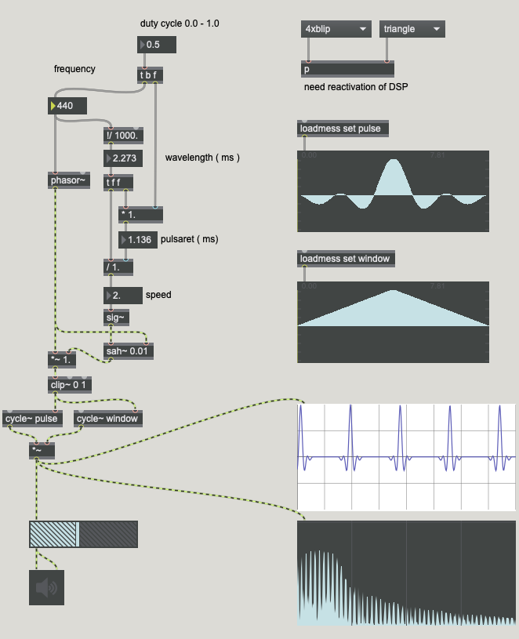

