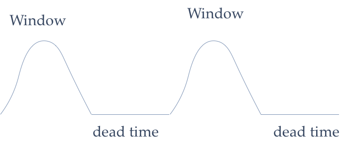
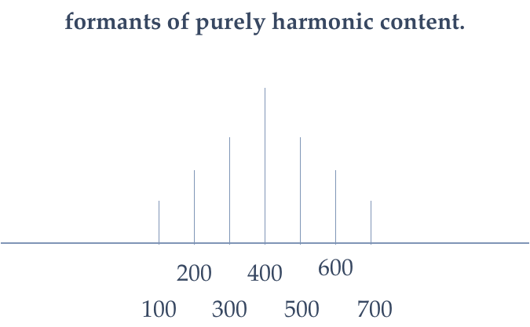
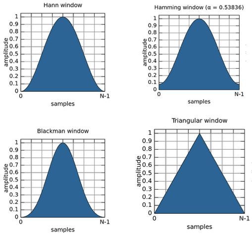
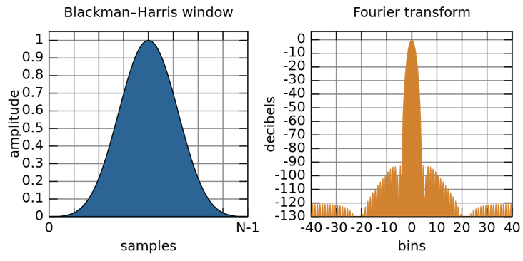
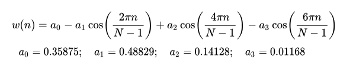
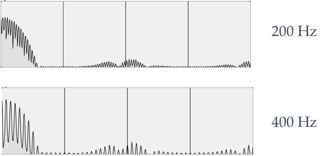
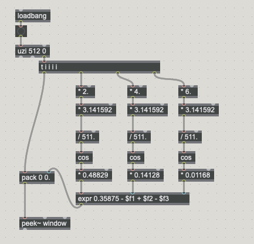
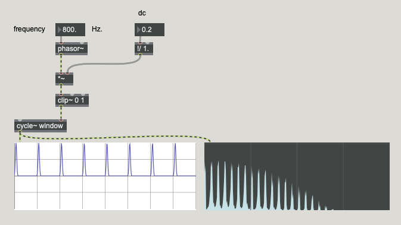

# Klasse 4

## Wave Function Synthesis (WFS)

Window function synthesis generates pulse streams that result in formants of purely harmonic content.

### Blackman-Harris Window

The number of harmonics increases as the fundamental frequency decreases.

For different fundamental frequencies, the duration of the WF pulse stays the same; only the interpose silence varies.

### Umsetzung

#### Blackman-Harris Window

#### WF main

