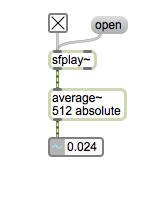
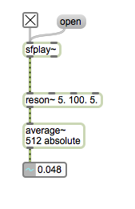
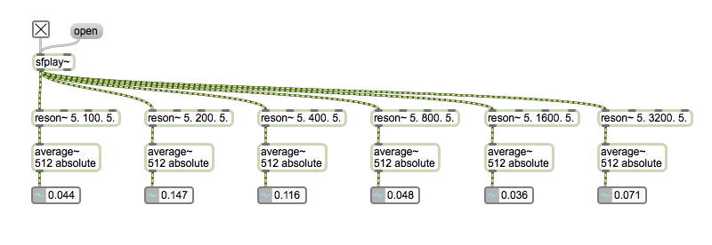
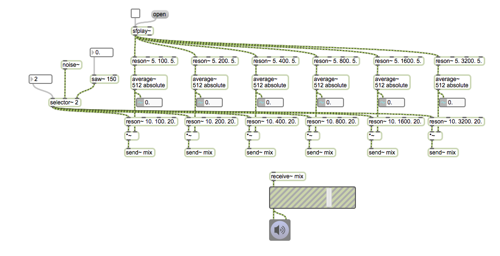
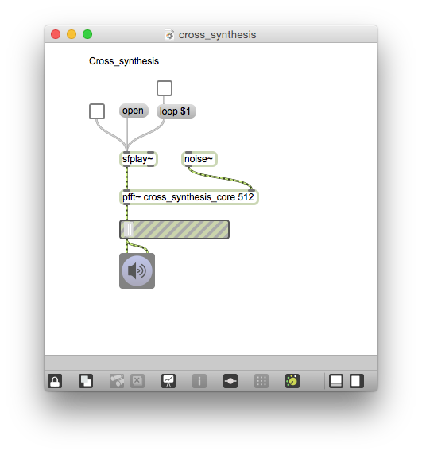
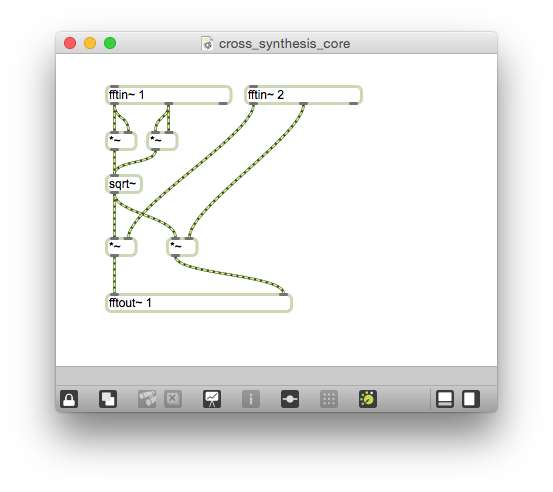

# Klasse 5

## Vocoder (Robot Voice)

### Pegelerkennung

### Pegelerkennung + BPF

### Mehrere Bänder

### Als parameter von anderen Filterbank

## Cross Synthesis

Das Spektrum der Klangdatei funktioniert als filter
