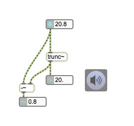

# Klasse 6

## Granular Sampling

### Looping

### Phasor und line~

### Phasor statt line~

### grain

### Position

### cos~

### Phasevershiebung

### Fensterfunktion

### trunc~

### Overlap and Add

