# Klasse 8

## Pitchshifter in Max

### fft-based object

- gizmo~

### ztx-based object (max 8)

- pitchshift~
- retune~ 

ZTX : [ztx website](http://www.zynaptiq.com/ztx/)

## FFT und Stimme

### FFT Core
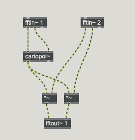

### Noise + Stimme

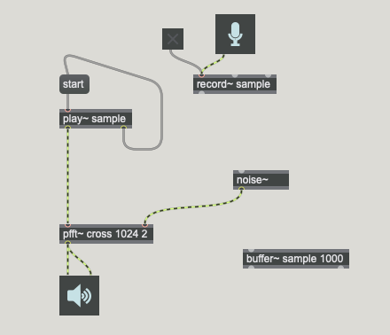

### Synthese + Stimme
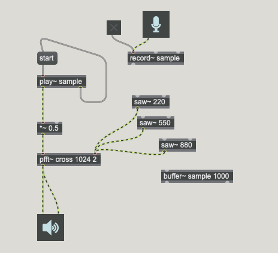

## Klangfarbeerkennung mit FFT

### FFT Ergebnis in einem Buffer

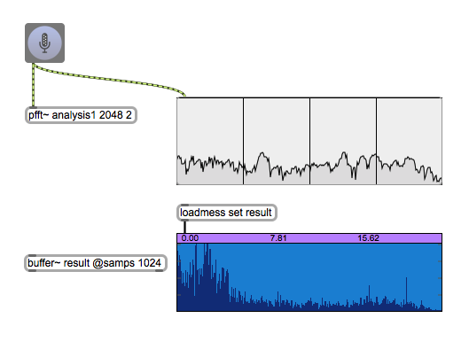
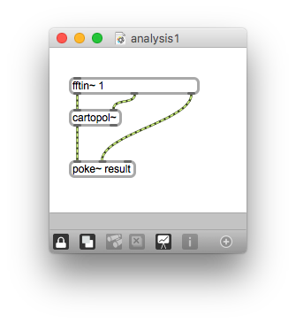

### Summe der Magnituden

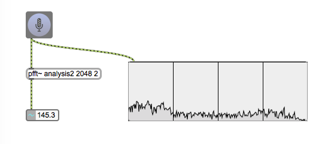
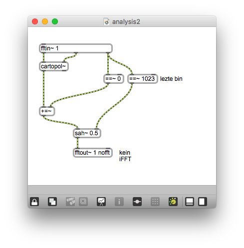

### FFT Abschnitt

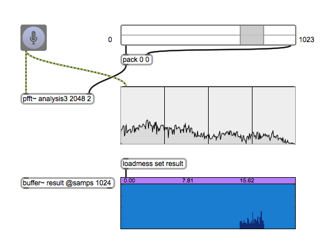
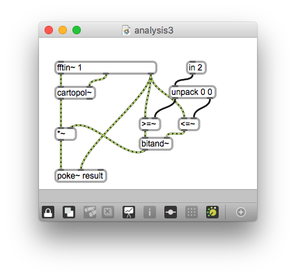

### Summe der Magnituden eines Abschnittes

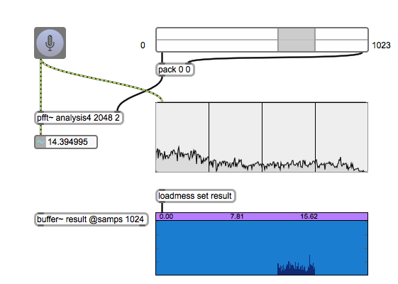
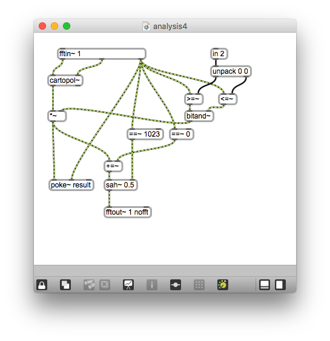

### Centroid

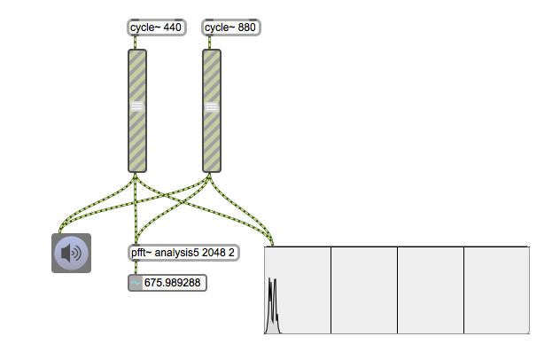
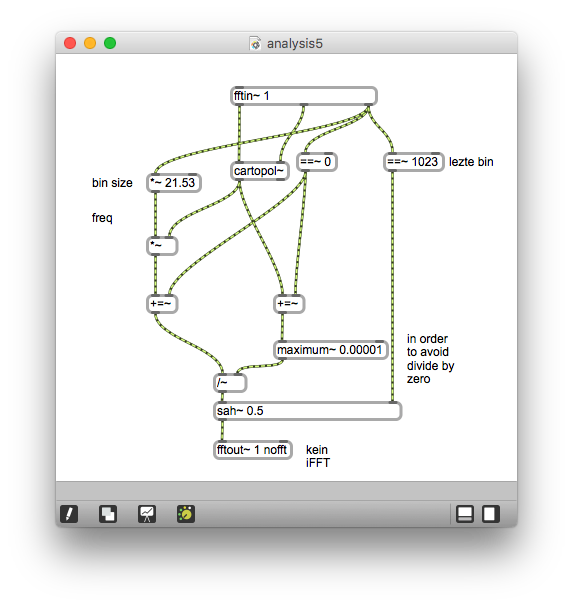
