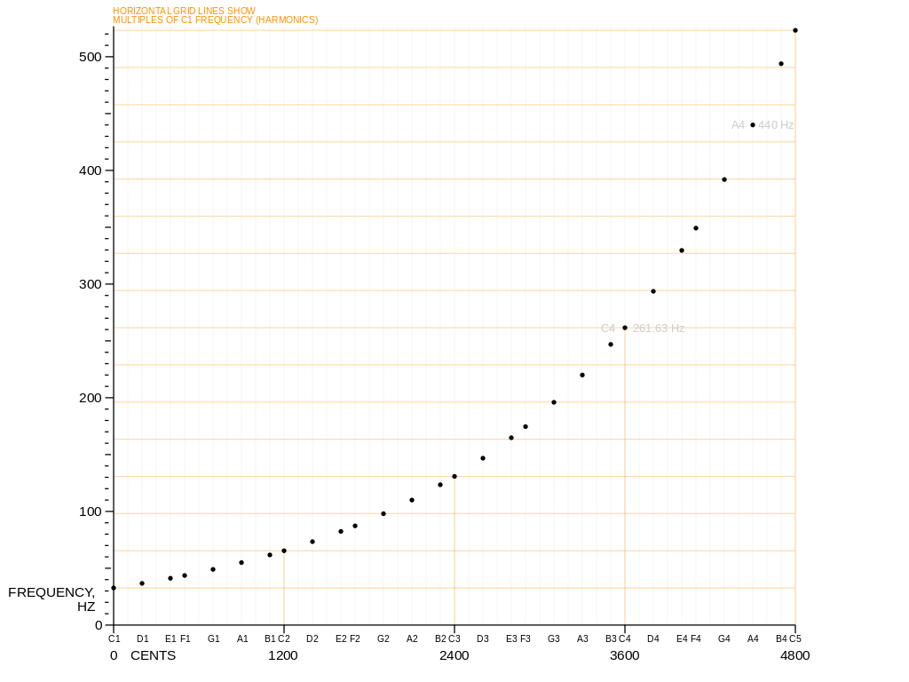
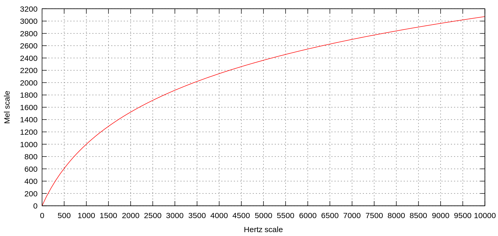
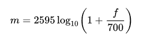
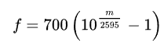
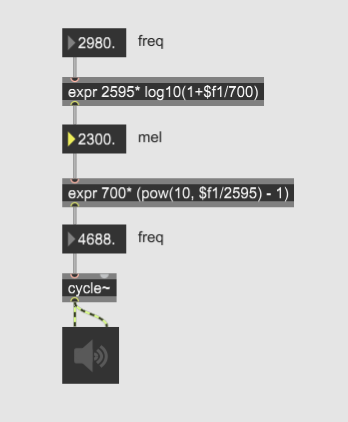
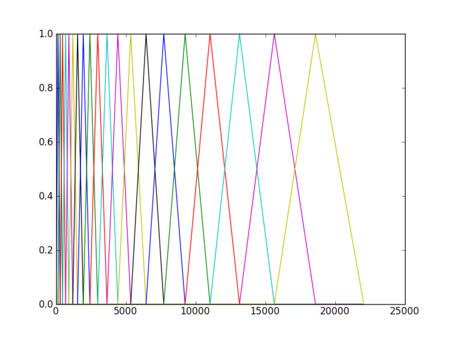

Klasse 9
========

 

Tonleiter und Frequenz
----------------------

 

Mel Scale
---------

 

The **mel scale** is a
perceptual [scale](https://en.wikipedia.org/wiki/Scale_(music)) of [pitches](https://en.wikipedia.org/wiki/Pitch_(music)) judged
by listeners to be equal in distance from one another. 

Formel
------

 

freq -\> mel

mel -\> freq

 

 

Umsetzung
---------

 

 

 

[MFCC (Mel Frequency Cepstrum Coefficients)](https://en.wikipedia.org/wiki/Mel-frequency_cepstrum)
--------------------------------------------------------------------------------------------------

 

In sound processing, the **mel-frequency cepstrum** (**MFC**) is a
representation of the short-term power spectrum of a sound, based on a linear
consine tranform of a [log power spectrum ]on
a [nonlinear](https://en.wikipedia.org/wiki/Nonlinear_system) [mel
scale](https://en.wikipedia.org/wiki/Mel_scale) of frequency.

 

MFCCs are commonly used
as [features](https://en.wikipedia.org/wiki/Features_(pattern_recognition)) in [speech
recognition](https://en.wikipedia.org/wiki/Speech_recognition)[[6]](https://en.wikipedia.org/wiki/Mel-frequency_cepstrum#cite_not)systems,
such as the systems which can automatically recognize numbers spoken into a
telephone.

 

MFCC Max externals
------------------

 

[zsa descriptors](http://www.e--j.com/index.php/download-zsa/)

 

 

 
-

 
