#Klasse 9 - Klangfarbeerkennung

### Klangfarbe

Spektrum

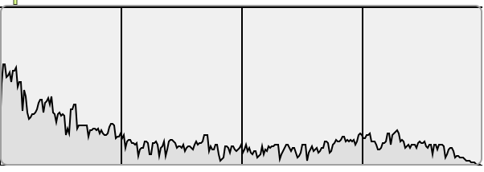

a...

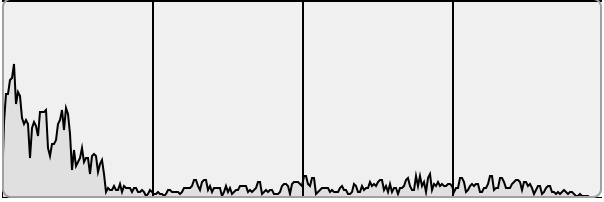

e...

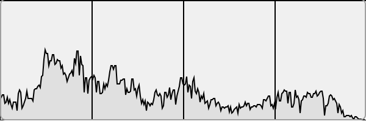

s...

Spektrum = wissenschaftliche Darstellung

Unsere Wahrnemung der Tonhöhe ist nicht Linear.

### Frequenzgruppen

 Mit Frequenzgruppen (engl. critical bands) bezeichnet man beim menschlichen Hören Frequenzbereiche, die gemeinsam ausgewertet werden. Eine Auswertung in Frequenzgruppen erfolgt z. B. bei der Bestimmung der **Lautstärke**, des Klangs oder der Richtung des Schalls. Eine Ausnahme ist die Auswertung der Tonhöhe selbst: hier ist die Frequenzauflösung wesentlich größer. Das menschliche Gehör teilt die hörbaren Frequenzen in etwa 24 Frequenzgruppen ein.

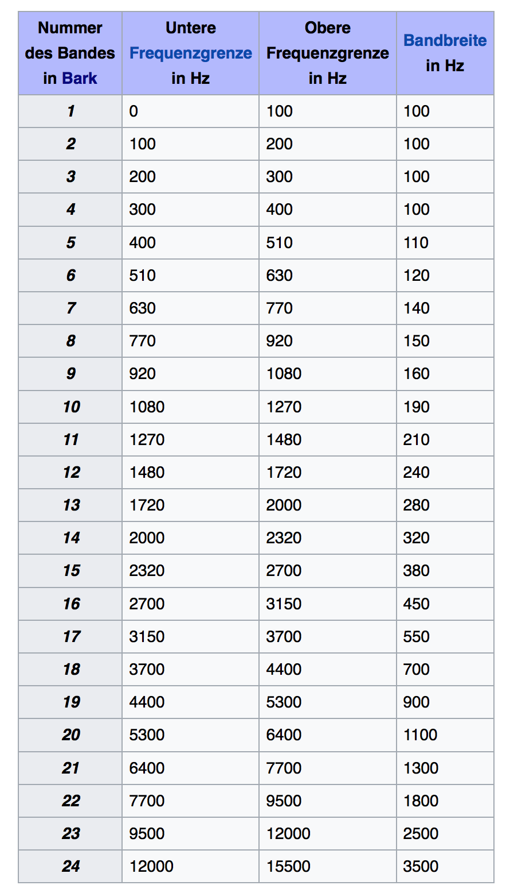

### Bark Skala

## patch1: bark~
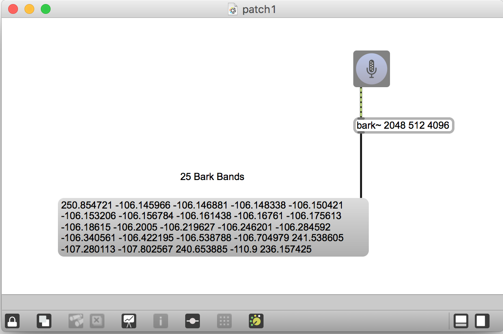

## patch2: Visualisierung
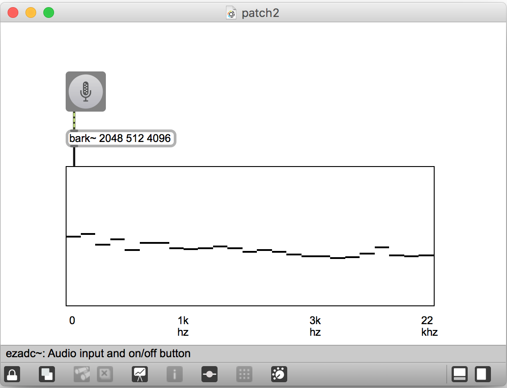

## patch3: Bark Skala Sampling mit tmp
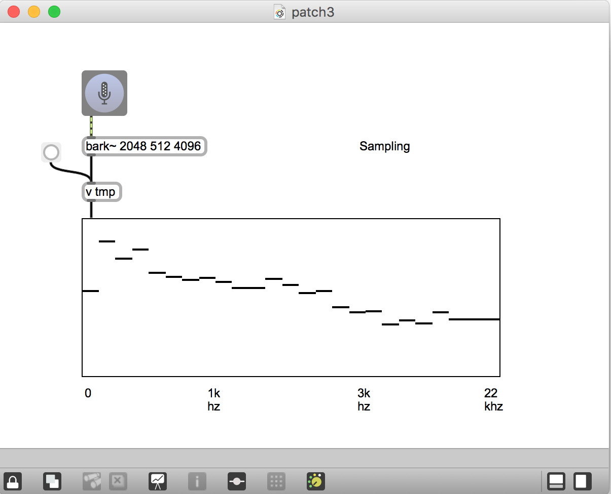

## patch4: 3x Bark Skala Sampling 
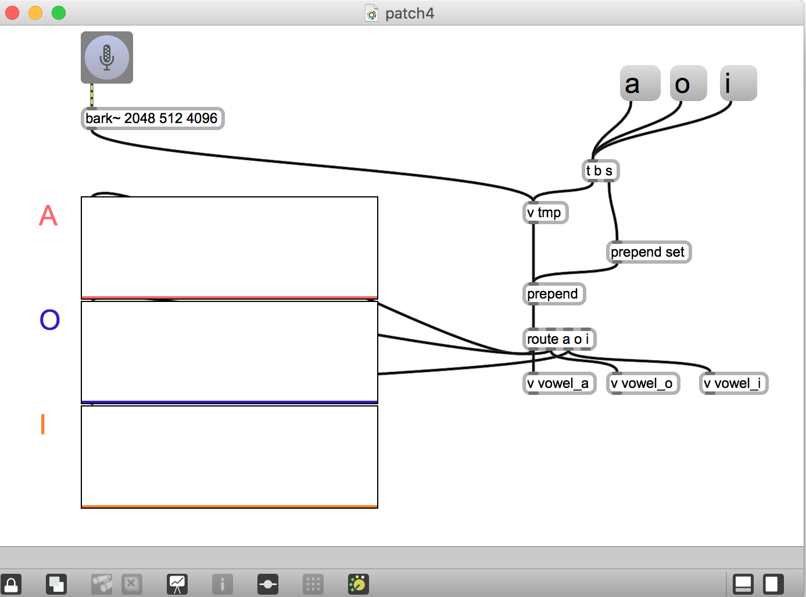

## patch5: Messung der Distanz zwischen zwei Skalen
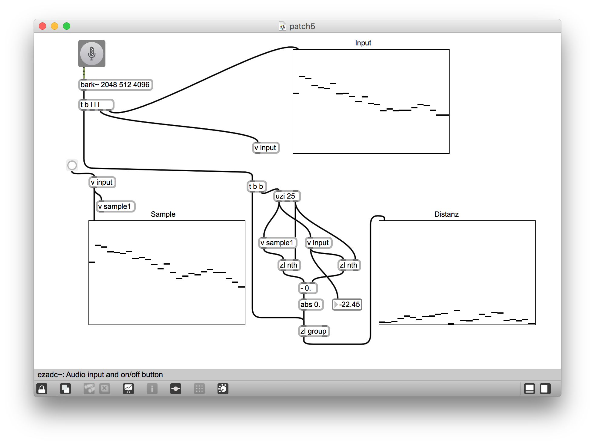

## patch6: Summe
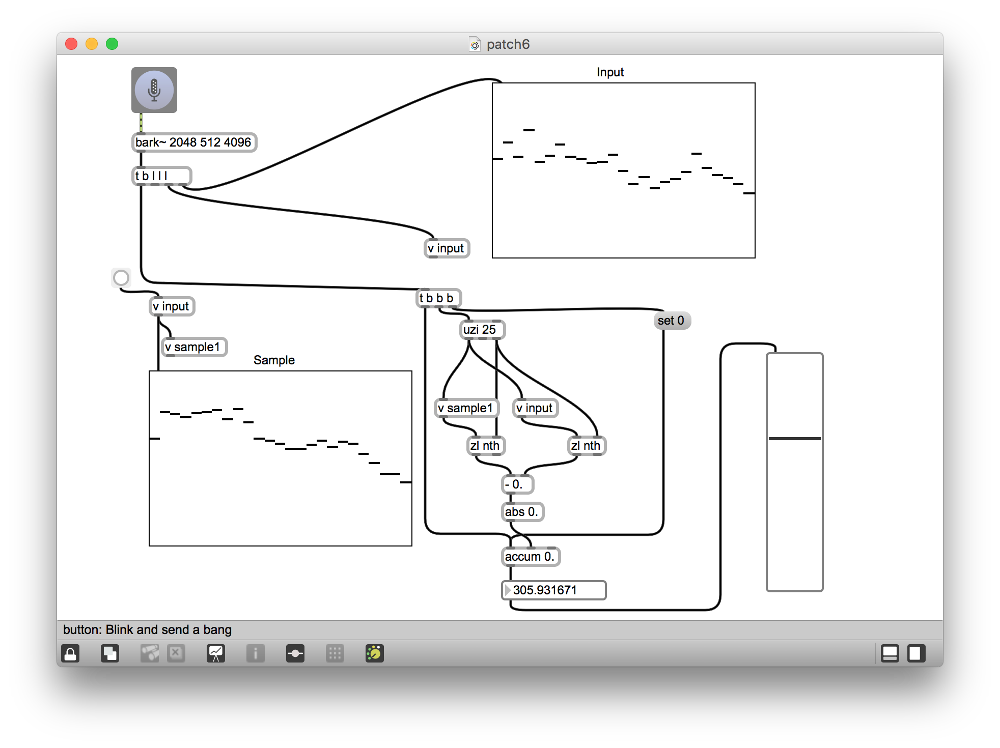

## patch7: Distanzen
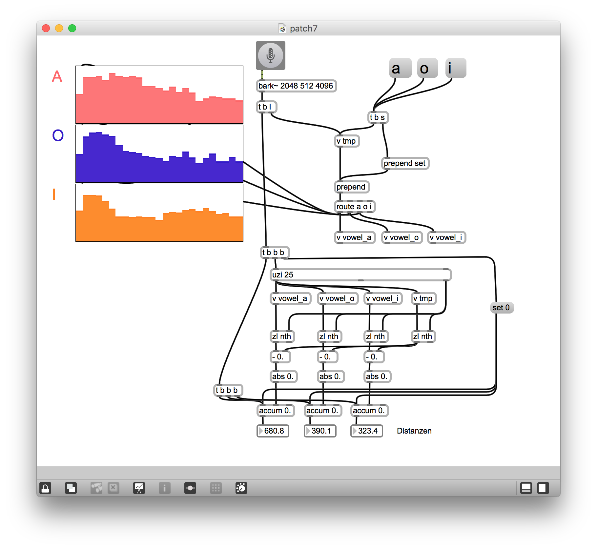

## patch8: Normalisierung
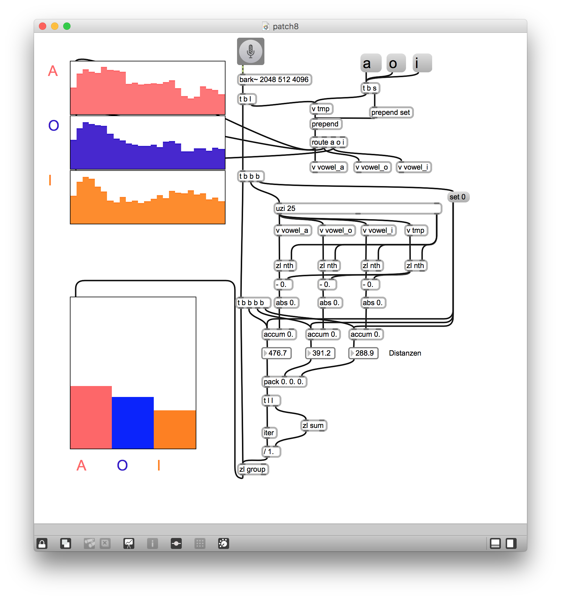

## patch9: Minimum
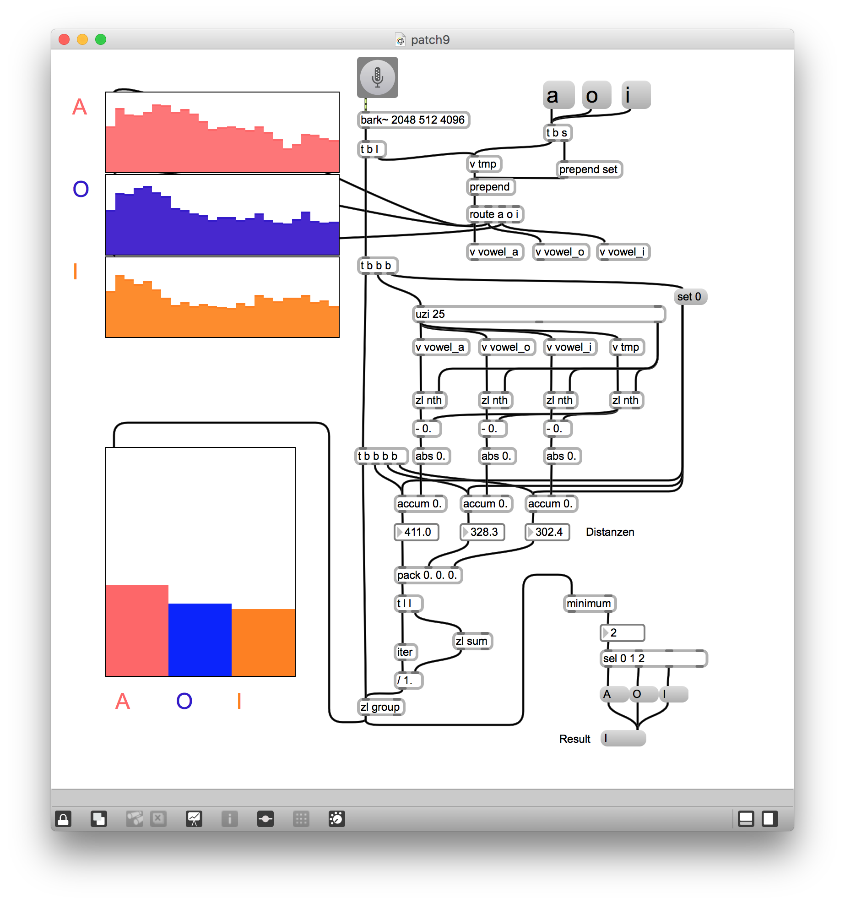

## patch10: Thresholding
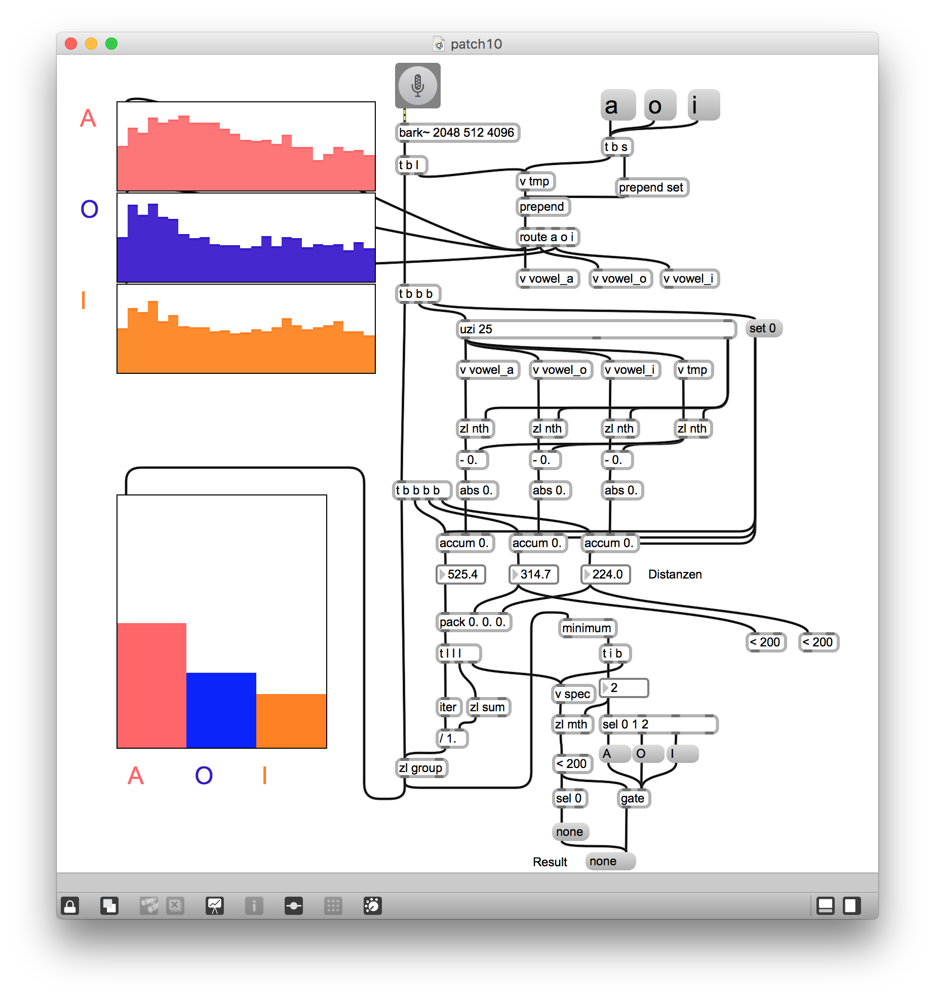